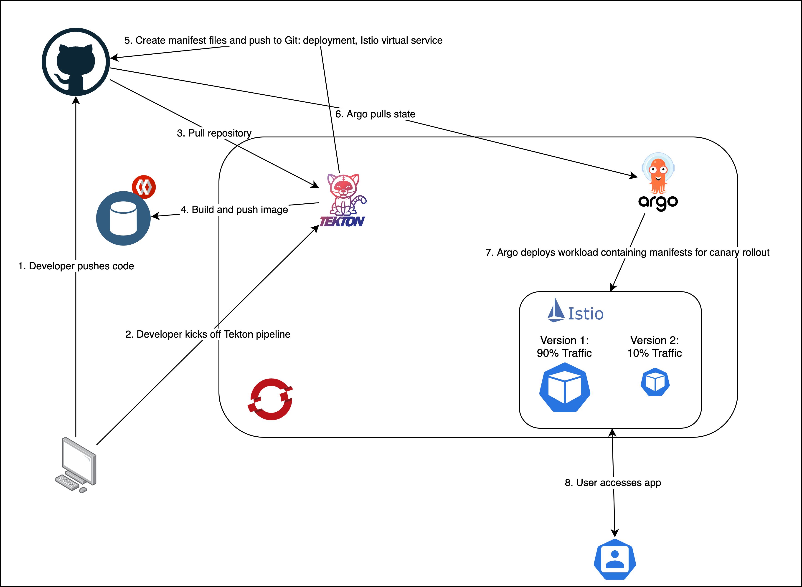
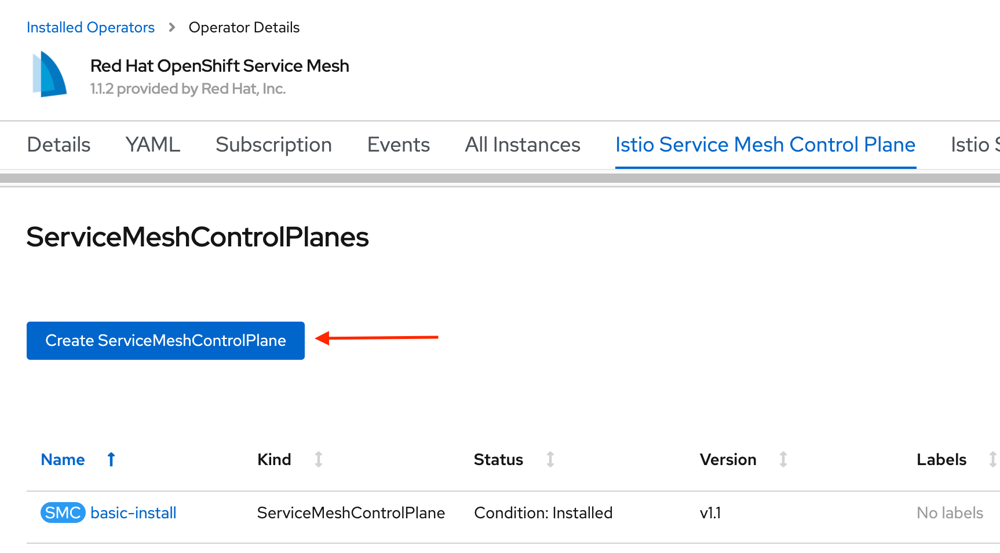
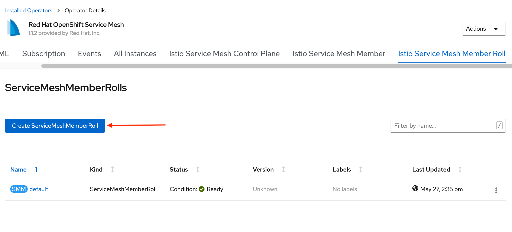
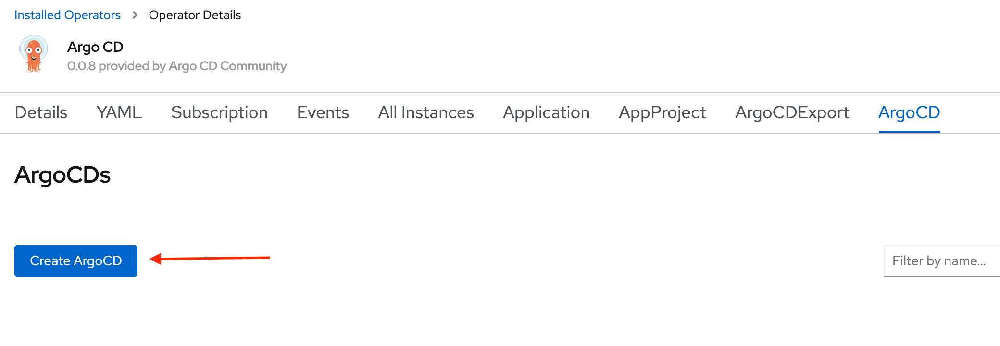
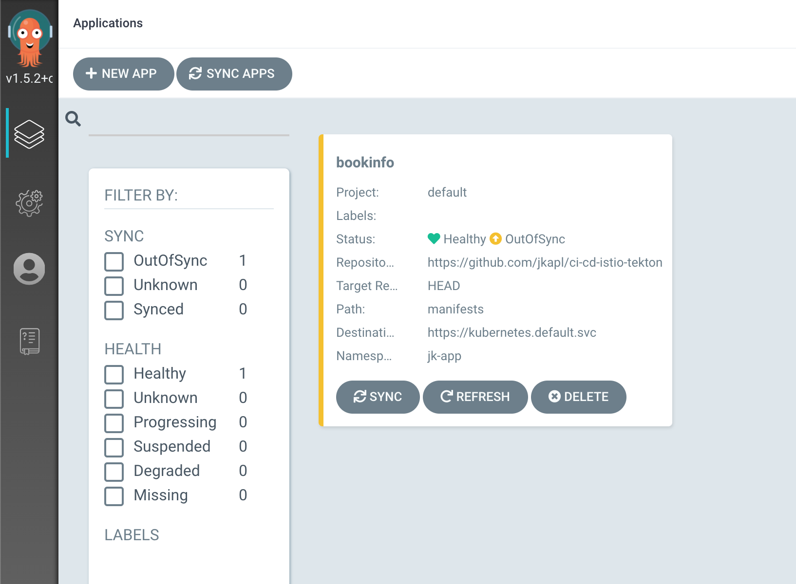

# CI/CD on OpenShift with Tekton and Istio
## Introduction
OpenShift is a powerful and secure platform for deploying containerized workloads. Combined with OpenShift Service Mesh and OpenShift Pipelines, it becomes a platform for enterprise agility, enabling continuous integration and continuous deployment via pipelines that build and push new code into managed canary rollouts. <br><br>With OpenShift Service Mesh, based on the Istio project; OpenShift Pipelines, based on Tekton; and Argo CD, a project that enables a GitOps approach to application management, developers can push changes to source code and within minutes see those changes deployed to a small subset of users. This iterative approach to software development means enterprises can rapidly and safely build new features and deploy them to end-users.

## Architecture

This GitHub repository provides a demonstration of how a Tekton pipeline can be used in tandem with a service mesh to deploy workloads automatically with a canary rollout.



### Installation

#### Software Versions Used
- OpenShift 4.4.3
- Argo CD Operator 0.0.8
- Elasticsearch Operator 4.4.0
- Red Hat OpenShift Jaeger Operator 1.17.2
- Kiali Operator 1.12.11
- OpenShift Pipelines Operator 1.0.1
- Red Hat OpenShift Service Mesh 1.1.2

Each of the operators above are available via OperatorHub in the OpenShift web console.

#### OpenShift Service Mesh (OSSM)
Use the OperatorHub tab in OpenShift to install the service mesh. Elasticsearch, Kiali, and Jaeger must be installed prior to Red Hat OpenShift Service Mesh. For more detailed instructions on the installation process, check out the [Istio demo on our GitHub page](https://github.ibm.com/cpat/ocp-chapter/blob/master/features/istio_guide.md) or consult the following link on the OpenShift official website:

[Installation steps for OpenShift Service Mesh Operator](https://docs.openshift.com/container-platform/4.4/service_mesh/service_mesh_install/installing-ossm.html)

Create a new project to hold the service mesh control plane. Then click on the Istio Service Mesh Control Plane tab in the OSSM operator details page. Click create ServiceMeshControlPlane. Click create to apply the default settings.<br><br>


Create a new project to hold the Bookinfo application, and add the name of that project to the service mesh member roll. Add the project under `spec.members`, then click create. This notifies the service mesh control plane to inject sidecar proxies into the pods running in the application project namespace.


#### OpenShift Pipelines
[Installation steps for OpenShift Pipelines Operator](https://docs.openshift.com/container-platform/4.4/pipelines/installing-pipelines.html)
#### ArgoCD
Create a new project to hold the Argo CD resources. Click on Installed Operators, then select the ArgoCD tab and click Create ArgoCD. Click create to apply the default settings.



Argo will deploy several pods in this namespace, including a server to access the Argo CD web console where users can check the status of any applications monitored by the Argo CD controller.  



Other pods include a Redis instance and an application controller.

For detailed installation instructions regarding the Argo CD operator, click here: [Installation steps for Argo CD Operator](https://argocd-operator.readthedocs.io/en/latest/install/openshift/)

## Demo

#### Service Accounts/Authentication
Like other Kubernetes resources, Tekton and Argo use service accounts to authorize their activity. Creating resources within the cluster of course requires specific permissions, but we can also use service accounts combined with secrets for authentication purposes, such as automatically pushing code changes to GitHub as part of a CI/CD pipeline. For Tekton, service accounts can be specified in a `PipelineRun` under `spec.serviceAccountName`. Inspect this field in the `tekton/pipeline-run.yaml` file. <br><br>When a `PipelineRun` executes, the permissions granted to the service account, as well as any associated secrets, are used to execute the tasks defined in the pipeline. In this demo, we are using a service account called build-bot, which requires two secrets: one to authenticate with the Quay.io image repository, and one to authenticate with GitHub. Within the `tekton/auth` folder, create a file called `secrets.yaml`. Fill out the information in the angle brackets below, and then run `oc apply -f secrets.yaml`

```
apiVersion: v1
kind: Secret
metadata:
  name: basic-user-pass
  annotations:
    tekton.dev/docker-0: https://quay.io # Described below
type: kubernetes.io/basic-auth
stringData:
  username: <quay-username>
  password: <quay-password>
---
apiVersion: v1
kind: Secret
metadata:
  name: basic-user-pass-2
  annotations:
    tekton.dev/git-0: https://github.com # Described below
type: kubernetes.io/basic-auth
stringData:
  username: <github-username>
  password: <github-password>
```

Tekton will take the specified credentials and convert them into a format sufficient for the application to consume. From the [OpenShift/TektonCD documentation](https://github.com/openshift/tektoncd-pipeline/blob/release-v0.11.3/docs/auth.md):

>In their native form, these secrets are unsuitable for consumption by Git and Docker. For Git, they need to be turned into (some form of) `.gitconfig`. For Docker, they need to be turned into a `~/.docker/config.json` file. Also, while each of these supports has multiple credentials for multiple domains, those credentials typically need to be blended into a single canonical keyring.
>
>To solve this, before any `PipelineResources` are retrieved, all pods execute a credential initialization process that accesses each of its secrets and aggregates them into their respective files in `$HOME`. [...]
>
>Credential annotation keys must begin with `tekton.dev/docker-` or `tekton.dev/git-`, and the value describes the URL of the host with which to use the credential.

For more information on ServiceAccount permissions and RBAC in Kubernetes, check out this link: [Using RBAC Authorization - Kubernetes](https://kubernetes.io/docs/reference/access-authn-authz/rbac/#service-account-permissions)

#### Persistent Storage
Tekton provides a `Workspace` resource, which combined with a `persistentVolumeClaim` (PVC), enables the sharing of data from one `Task` to the next within a `Pipeline`. As an example, in this demo a `Workspace` backed by a PVC is used to pass source code from GitHub between a `Task` that builds a new application image and a subsequent `Task` that pushes modified source code with new manifest files to GitHub. <br><br>The details of the PVC will vary depending on how administrators configured the OpenShift environment. In some cases it may be necessary to specify the `storageClass` required for the PVC to bind to an available volume.

```
apiVersion: v1
kind: PersistentVolumeClaim
metadata:
  name: joel-ci-cd
spec:
  #storageClassName: rook-cephfs
  accessModes:
    - ReadWriteOnce
  resources:
    requests:
      storage: 1Gi
```
The `PipelineRun` resource specifies the `Workspace` required for the `Pipeline` to execute successfully.

#### Tasks, Pipelines, and PipelineRuns

The `Pipeline` in this repository consists of three `Tasks`. The first, `git-clone`, clones code from a GitHub repository and stores it in a `Workspace`. The second, `build-service`, builds a new image and pushes it to an image repository. Finally, `canary-rollout` creates and pushes new manifest files to GitHub, which include a Kubernetes `Deployment` specifying the new image to use, as well as Istio resources to enable a canary rollout of the new code.

The last step in this demo configuration uses Argo CD to deploy the newly created manifest files from GitHub as workloads in the cluster. As mentioned above, the manifests include routing rules for the Istio control plane to split traffic between previous versions of the microservice, with 10% sent to the new version. The Istio resources include a `DestinationRule` and `VirtualService`:

```
add rules here
```

To initiate a `Pipeline` we create a `PipelineRun`:
```
oc create -f pipeline-run.yaml
```
By passing parameters to the `PipelineRun`, we can specify which microservice to we intend to be built and deployed to the cluster. Parameters can be specified in the `PipelineRun` yaml file directly or using the command line. In this example `PipelineRun` we specify the location of the source code and revision to use, the builder image and image repository to use to build and push the new image, as well as the microservice to deploy and the tag to apply to the new version of the image.

```
  params:
    - name: GIT_URL
      value: https://github.com/jkapl/ci-cd-istio-tekton 
    - name: BUILDER_IMAGE
      value: https://quay.io/buildah/stable:v1.14.0
    - name: REVISION
      value: master
    - name: SERVICE_NAME
      value: productpage
    - name: IMAGE_REPOSITORY
      value: quay.io/jkap
    - name: SERVICE_VERSION
      value: v2
```

## References

[Bookinfo application demo](https://github.com/tnscorcoran/openshift-servicemesh)